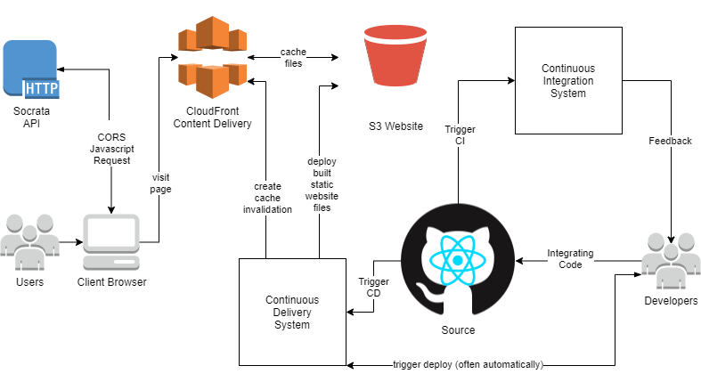

# FOOD TRUCK FINDER
A python (`3.5`) command line interface (CLI) program that displays currently open food trucks in the San Fransisco Area.
The program queries the Scrota API for the San Fransisco dataset [Mobile Food Truck Schedules](https://dev.socrata.com/foundry/data.sfgov.org/jjew-r69b).


## TL;DR
```bash
pip3 install -r requirements.txt
python3 show_open_food_trucks.py
```

## Prefer Docker?

### Build
```bash
docker build -t food-truck-finder:latest .
```
### Run
```bash
docker run -i food-truck-finder:latest
```

## Proposal Write-Up - Proof-of-Concept to Production

This simple CLI program, while successfully demostrating proper Scrota API development, leaves much to be needed as a scalable production system. This service is best suited as a browser-based web application, where the Socrata API can be queried directly from each visitor's own browser. To convert this simple CLI into a scalable application would require a re-write, and ultimately a move from Python to Javascript. My design would use a simple statically hosted web-page without the need for any additional complex back-end servers. A static site could be hosted on a number of different providers, we can choose between: GitHub Pages, S3 Website, GCP Google Storage, or Heroku. Each provider offers a set of tooling for deploying, monitoring, and controlling the content delivery of our website. Further, while this static site could be written using vanilla html/javascript, I propose we choose a industry supported UI framework such as ReactJs. ReactJs allows us build a simple and re-usable component driven UI as a single page application. To save valuable time, we will choose an existing component library UI toolkit (or one of our companies choosing). There are many to pick from: MaterialUI, React Bootstrap, Ant Design, etc.. Any of these libraries will mae our website look profession with minimal front-end development effort. I'm most familiar with S3 Website, React, and Material UI, so these would be my personal choices, but any tech should get the done the job well.

### Proposed Architecture Diagram
